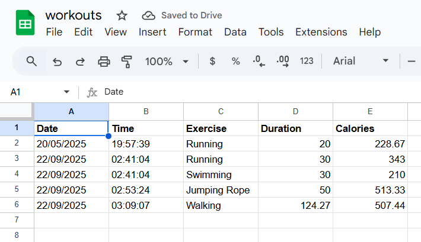
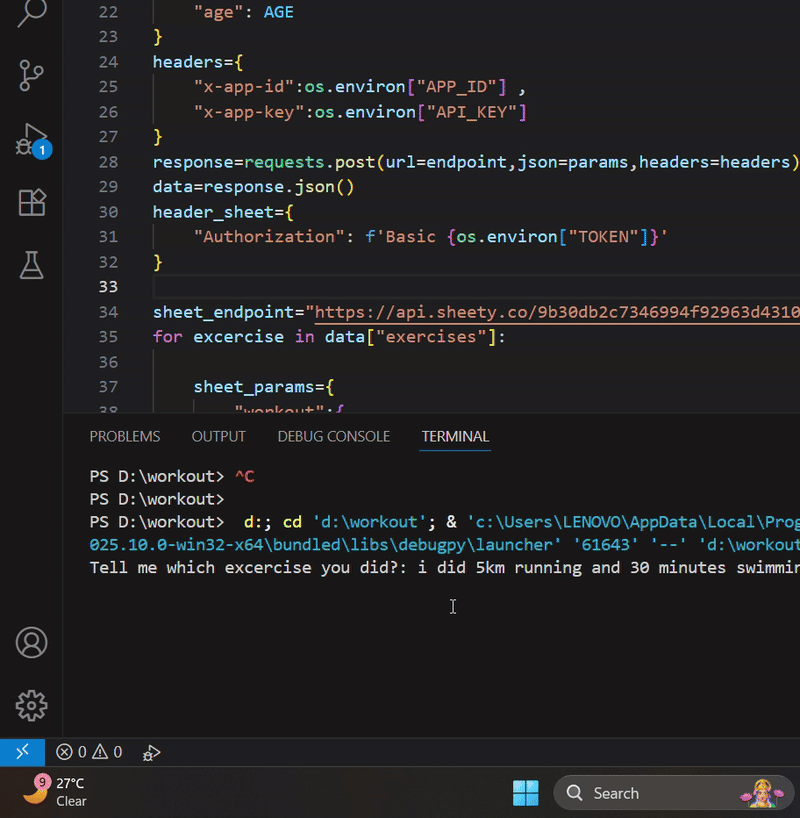

# Workout Tracker

A Python project that automatically logs your exercises, duration, and calories burned into a Google Sheet using **Nutritionix API** and **Sheety API**.

---

## What This Project Does

- Tracks exercises with **duration** and **calories burned**  
- Stores workout data in a **Google Sheet**  
- Uses **environment variables** to securely manage API keys  
- Simple **command-line interface** for quick logging  

---

## Technologies Used

- Python 3  
- Requests library  
- python-dotenv  
- Nutritionix API  
- Sheety API  

---

## Setup & Installation

Clone the repository to your local machine and navigate to the project folder:

```bash
git clone https://github.com/Agam00/Python-Projects.git
cd Python-Projects/workout-tracker
```

Create a Python virtual environment and activate it:
```bash
python -m venv venv
# Windows:
venv\Scripts\activate
# Mac/Linux:
source venv/bin/activate
```

Install the required dependencies:
```bash
pip install requests python-dotenv
```
Create a .env file in the project folder and add your API keys and 
personal information:
```bash
APP_ID=YOUR_NUTRITIONIX_APP_ID
API_KEY=YOUR_NUTRITIONIX_API_KEY
TOKEN=YOUR_SHEETY_TOKEN
GENDER=your gender
WEIGHT_KG=your weight
HEIGHT_CM=your height
AGE=your age 
```
Make sure .env is listed in .gitignore to keep your keys private.

## How to Run
```bash
python main.py
Enter the exercise you did when prompted (e.g., running for 30 minutes)
```
Your workout data will be automatically logged into your Google Sheet.

## Screenshots / Demo

### Screenshot


### Demo GIF


## Author
Agam Arora

GitHub: https://github.com/Agam00

LinkedIn: www.linkedin.com/in/agam-arora-82024b2ab


## License
MIT License

